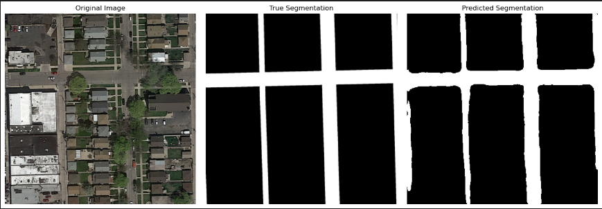
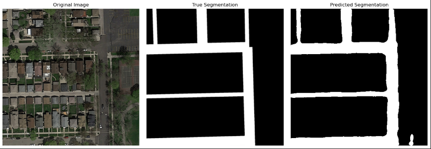
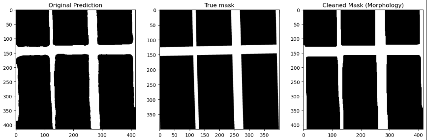
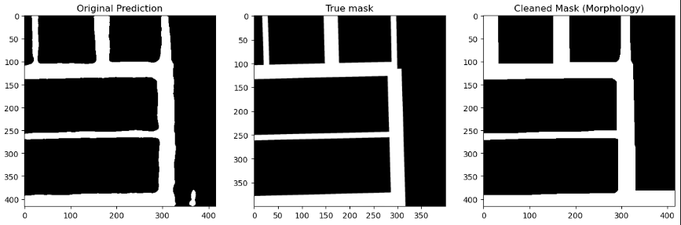
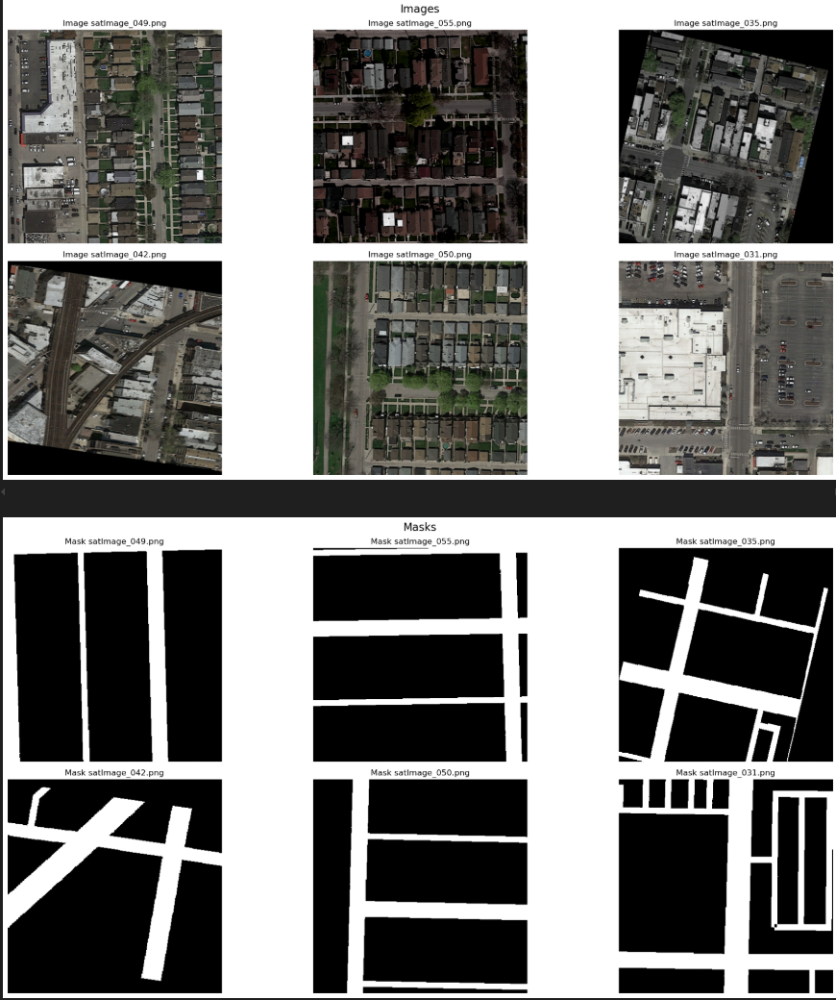
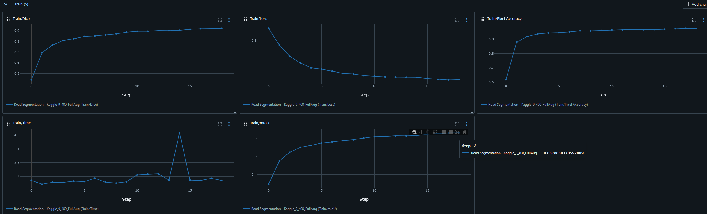
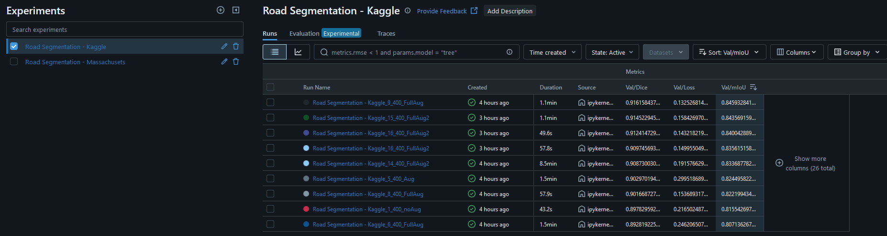
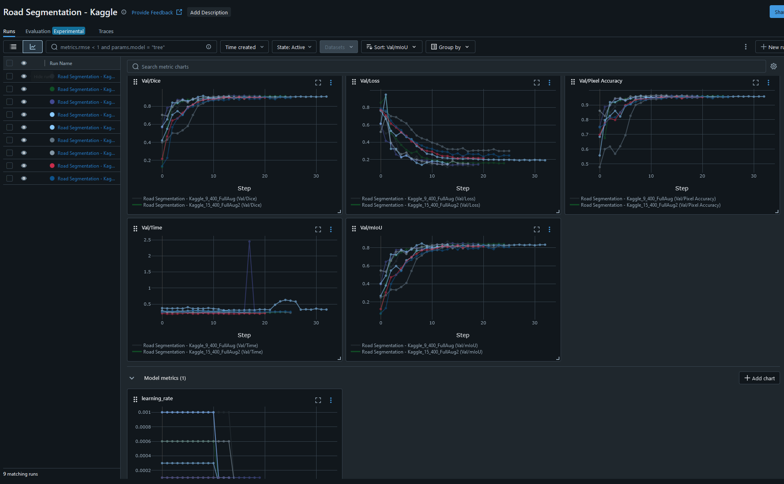
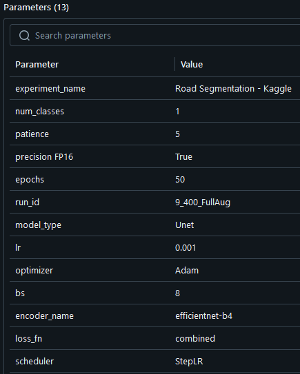

# 🛰️🚧 Aerial Road Segmentation using SMP (Segmentation Models for Pytorch) 🌎
This project fine-tunes a deep learning model, specifically a UNet with an EfficientNet-b4 backbone using PyTorch, to perform semantic segmentation on aerial imagery. It is designed to be modular, efficient, and easy to use, especially for those working with Jupyter Notebooks. It allows the flexibility to change the model's backbone using the segmentation_models_pytorch library and provides tools to monitor and adjust hyperparameters, ensuring streamlined experimentation.

The segmentation task focuses on identifying roads regions in aerial images. The model predicts pixel-level masks to delineate the target areas.

Key results:

- mIoU (Mean Intersection over Union): 0.85

- Dice Score: 0.93

The model is fine-tuned on a RTX 2080 SUPER GPU for 30 epochs, taking approximately 1 minutes and 15 for the total training. The primary goal is not necessarily to achieve the best possible segmentation results but rather to showcase the process of building and fine-tuning a segmentation model. The pipeline is scalable and can be adapted for larger datasets or more complex use cases.

This project demonstrates the effectiveness of semantic segmentation in aerial image analysis and serves as a practical template for further customization and improvement.
  
---

## ✨ **Highlight results**

### **Road mask predictions** 🖇


> *Great mask prediction*
<br>
<br>



> *Post-processed mask that match accurately to the expected mask*
<br>
<br>

### **Albumentations augmentations for better generalization** 🎭

> *Use of albumentations to create augmented images*


### **Confusion Matrix (Test dataset)** 📊

> *Model  example results after training* 
<br>
<br>

### **Metrics and hyperparameters monitoring using MLflow** 🔱



> *Experiment tracking using MLflow*
<br>
<br>


> *Hyperparameters log using MLflow*

---

## 📖 **Project Walkthrough**


In this project, we will take you step-by-step through the process of creating this classifier using PyTorch, integrate TensorBoard and analize using Captum. Below is a summary of the key steps:

1. **Define custom datasets and dataloaders with PyTorch**:  

  - *Preprocessing images to normalize and create batches of data.*  

2. **Visualization of initial data with their true labels**:  

  - *Plotting images with their labels to understand the dataset.*  

3. **Configure MLflow for visualization of training metrics**:  

  - *Monitor loss,  mIoU , Dice and Pixel Accuracy in real time using MLflow. Save the logs for visualization at any moment.*  

4. **Training and validation cycle**:  

  - *Use PyTorch to perform transfer learning of our model*.  

5. **Model inference**:  

  - *Visualizing mask predictions.*
    
6. **Simple post-process using OpenCV and Morphology operations**:  

  - *Improve mask visualization using OpenCV lib.* 


---
## 📊 Dataset
This project uses [Road Segmentation Data](https://www.kaggle.com/datasets/rajsahu2004/road-segmentation-data) from Kaggle.

The dataset contains 100 pairs of images, ground truth, and a test set with pictures from Google Maps. The masks uses 2 classes (road, background)

Download it from the above link and extract in the root  folder to work with the project (you can call it `dataset` for instance)

---


## 📂 **Project Structure**
The project is organized in a modular way imported in the main Jupyter Notebook to improve code readability and maintainability.
```markdown
Aerial-Scene-Classifier/
├── assets/                           # Images for the README file
├── src/                              # Modular code used in the project
│   ├── loss.py  
│   ├── metrics.py
│   ├── training_seg.py
│   └── visualization.py
├── README.md                         # Documentation of the project
├── requirements.txt                  # Dependencies
└── road_segmentation_kaggle.ipynb    # Main notebook for the walktrough
```

## ✨ **Main features of the project**
- **Clear modularization**: The project is divided into logical sections for ease of use and understanding.
- **Easy training and real-time logging**: Predefined settings to train the model on new datasets that follow the same folder structuring as the original dataset. In addition, it is possible to monitor the training in real time with MLflow.
- **Great mask prediction( 93%+)**: The model is able to create accurate masks from the input aerial images.
- **Simple execution and results visualization**: The project can be followed step-by-step using the main jupyter notebook.

---

## 🛠️ **Libs, Frameworks and Technologies**
- **Python**: Main programming language.  

- **Jupyter Notebooks**: For workflow organization.  

- **PyTorch**: Framework for creating the training and validation structure of the deep learning model.

- **Segmentation Models for PyTorch**: Framework for loading and configuring segmentation models like Unet,DeepLabV3++ and more

- **Albumentations**: Library to create real and accurate augmentations to the input images and masks.

- **MLflow**: Tracking of experiments and metrics

- **OpenCV / PIL**: For image processing, manipulation.  

- **Numpy/PyTorch**: Data management and numerical calculations.

- **Matplotlib/Seaborn**: Results visualization.

- **Scikit-learn, timm, tqdm**: Support libraries


---

## 📖 **How to follow the project Walktrough**

### **1. Clone the repository**
Clone the project in your local machine:
```bash
git clone https://github.com/eduardo-lezama/aerial-road-segmentation.git
```
### **2. Download the dataset**
The dataset required for this project is hosted in Kaggle. Follow these steps to download it:

1. Visit the dataset page on Kaggle: [Road Segmentation Data](https://www.kaggle.com/datasets/rajsahu2004/road-segmentation-data)

2. Download the `.zip` file of the dataset.  

3. Extract the contents into the dataset/ folder of the project. The structure should look like this:

City-Scene-Classifier/  

```markdown
├── dataset/.  
|
│ ├─── test_set_images/     # Images for testing your model,
| |   ├──image1.png
| |   ├──image2.png
│ ├─── training/            # Training folder.  
| │   ├── groundtruth
| |   |   ├──mask1.png      # Mask images. 
| |   |   ├──mask2.png
| |   |   ├──...
| |   ├── images 
| |   |   ├──image1.png     # Images for training.
| |   |   ├──image2.png
...
```
  

**Note:** If you decide to place the data in a different folder name, be sure to update the path to the data in the main file of your Jupyter Notebook **(road_segmentation_kaggle.ipynbb)**.

### **3. Install dependencies**
Make sure you have a virtual environment set up (optional, but recommended). Then install the required dependencies:
```bash
pip install -r requirements.txt
```
### **4. Follow the main Jupyter for an easy step-by-step explanation**
**01_city_image_classifier_main.ipynb** is the main Jupyter Notebook of the project. Inside there is an easy step-by-step guidance to reproduce the project, train the model, use different models, change hyperparameters and so.  

### **5. During training and experimentation, use MLflow local webapp**
When the training is happening:
1. Open a new terminal in your IDE
2. Set the folder to the project folder
3. Execute the following code: `mlflow ui`
4. The terminal will create a local server and give you a link address like: `http://localhost:<your_port>/`
5. Open the link and you will see the GUI of TensorBoard where you can follow your metrics, prints and others.

You can always execute step 3 to see your results again at any moment.


## 🌟 **Contact**

-   **Email**: rebound-buddy-size@duck.com
-  **GitHub**: https://github.com/eduardo-lezama
